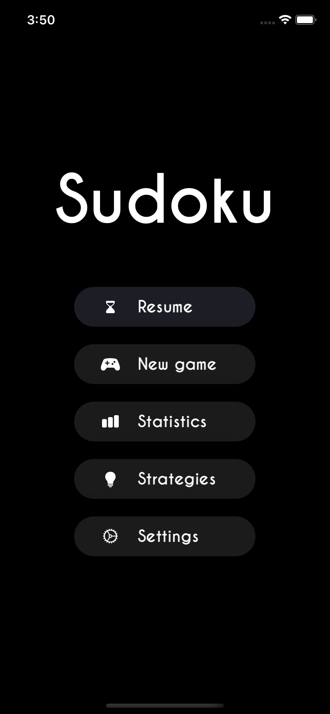
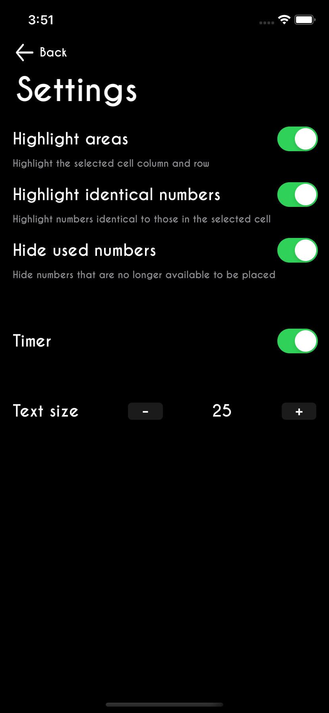
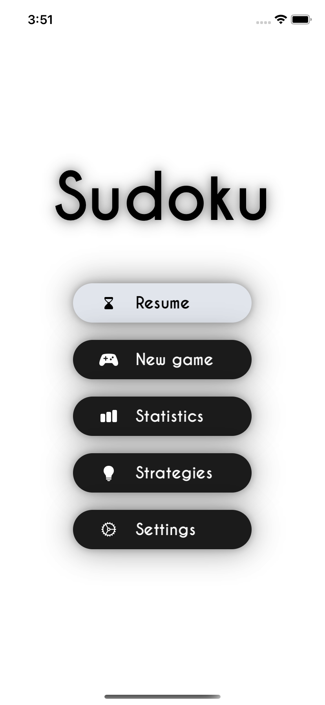
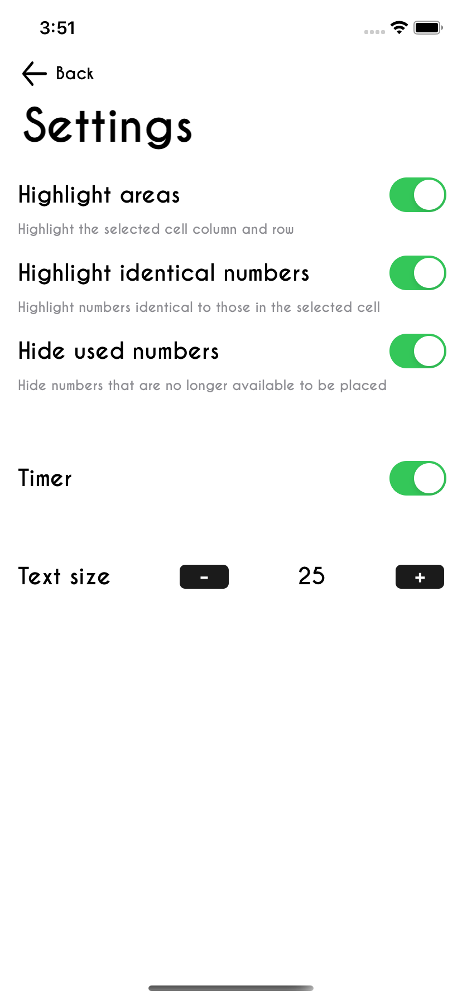
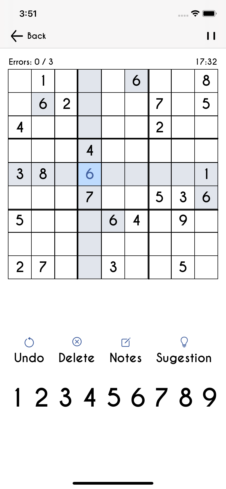

# About

A Sudoku for iOS built with SwiftUI. SwiftUI also allows easy iPadOS and macOS deployments, but the current code base doesn't quite support them yet.

# Screenshots

## Dark
| **Welcome** | **Settings** | **Board** |
|:---:|:---:|:---:|
|  |  |  |

## Light
| **Welcome** | **Settings** | **Board** |
|:---:|:---:|:---:|
|  |  |  |
